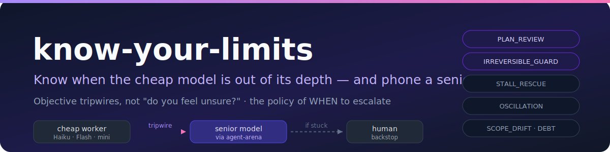

# know-your-limits

> **A cheap model running a long task should know when it's out of its depth — and phone a senior, instead of confidently guessing.**

<p align="center">
  
</p>

<p align="center">
  <strong>English</strong> · <a href="README.zh.md">中文</a>
</p>

<p align="center">
  <a href="#installation"></a>
  <a href="#claude-code"></a>
  <a href="#openai-codex"></a>
  <a href="https://github.com/zhjai/agent-arena"></a>
  
  <a href="LICENSE"></a>
</p>

You run a small/cheap model (gpt-5-mini, Claude Haiku, GLM-4.7-Flash, deepseek-v4-flash, kimi-k2.7-code-highspeed…) as the primary worker on a long task to save tokens. It does the grunt work fine — until it hits a hard moment (a bug it can't crack, a plan that needs judgment, an irreversible change) and **confidently guesses wrong**, burning hours on a bad path.

`know-your-limits` is the **policy of WHEN** that worker should escalate the hard parts to a strong senior model. The escalation **mechanism** is [`agent-arena`](https://github.com/zhjai/agent-arena) (it makes the heterogeneous cross-model call); this skill decides *when* to pull that lever, so you pay for the expensive model only at the moments that need it.

Best for: large multi-step refactors · codebase-wide changes · migrations · long unattended agent runs · any task where "lots of cheap grunt work + a few hard moments" describes the shape.

Not for: short tasks · tasks that are mostly-hard (just use the senior directly) · trivial reversible steps.

It is designed for **Claude Code, OpenAI Codex, Hermes Agent, OpenClaw, OpenCode, Copilot CLI, and other AI coding agents** that support custom skills and lifecycle hooks.

> **Important:** this repository is a policy skill plus a thin trigger hook. It does **not** install, authenticate, or call the senior model itself — that is [`agent-arena`](https://github.com/zhjai/agent-arena)'s job, and agent-arena in turn depends on the host having the senior's CLI, credentials, and shell access. Without agent-arena installed, this skill degrades to "flag the hard moment and ask the human."

This project is not affiliated with Anthropic, OpenAI, or any model vendor.

## The core idea: tripwires, not "do you feel unsure?"

The trap: **an overconfident/cheap model is exactly the one that won't notice it's stuck.** Asking it "are you unsure?" is self-referential — it'll say no and keep guessing.

So escalation fires on **objective, observable events** instead:

| Trigger | Fires when… | → escalate for |
|---|---|---|
| **PLAN_REVIEW** (mandatory) | a substantial/risky task starts | review the plan before doing it |
| **IRREVERSIBLE_GUARD** (mandatory) | about to do a schema change / migration / delete / deploy / auth change / add a dependency | review *before* the irreversible action |
| **PRE_DONE_REVIEW** (mandatory) | about to call an L2/L3 task done (or a large/risky L1 diff) | a real review before "done" |
| **STALL_RESCUE** | the same error survives 2 different fix attempts | stop guessing, get a root-cause |
| **OSCILLATION** | same file edited 3× with no passing check | the approach is wrong, not the code |
| **SCOPE_DRIFT** | touched ≥3 unplanned modules before any check passes | confirm scope before spreading |
| **CHECKPOINT_DEBT** | ≥40 actions since phase start / last checkpoint, no checkpoint passed | senior audit to confirm still on track |
| **GATE_BLOCK** | an [`agent-completion-gate`](https://github.com/zhjai/agent-completion-gate) check returns BLOCKED | fix the real cause |

The **mandatory** ones don't depend on the worker noticing anything — they fire on the task class and the action type. The **reactive** ones are *counted by a hook*, not by the model (a cheap model mis-counts its own attempts).

## What it does — a concrete run

**Scenario:** a cheap worker is fixing a failing endpoint. The same test keeps going red.

```text
attempt 1 → POST /orders → 500 "TypeError: cannot read 'id' of undefined" → fix guess A → still 500
attempt 2 → same error fingerprint → fix guess B → still 500
            └─ hook counts: same error survived 2 attempts → STALL_RESCUE trips
```

**The worker stops guessing and escalates** (via agent-arena, mode `solo_red_team`, single senior — a bounded bug diagnosis only needs one strong model, GPT/Codex by default). It sends a **minimal packet**: the trigger, the goal, the raw stack trace + the two diffs it tried — *not* its own pet theory.

**The senior replies in a compact schema** the cheap worker can actually act on:

```yaml
status: replan
diagnosis: "The handler reads req.user before the auth middleware runs on this route."
next_actions:
  - Register requireAuth on the /orders router, before the handler
  - Return 401 (not 500) when req.user is absent
checks:
  - npm test -- orders.spec
risks:
  - Other /orders routes may rely on the same missing middleware
```

The worker applies the fix, the test passes, the hook resets the stall counter — and you paid for the senior **once**, at the moment it mattered, not on every trivial step.

## Why a hook, not just a skill

A cheap worker can't reliably track "have I failed the same way twice?" across a long session — it mis-counts, rationalizes ("this attempt was different"), and loses the count when context compacts. So the reliable setup is **the skill + a thin hook**:

- The **hook** ([`integrations/hooks/kyl_hook.py`](integrations/hooks/kyl_hook.py)) keeps a small on-disk **escalation ledger** (attempts per error, files touched, modules, actions, budget) from real lifecycle events, and **nudges escalation when a tripwire trips**. It never makes the senior call, never blocks, never marks anything done, and exits 0 on bad input.
- The **skill** owns the mandatory escalations (start / irreversible / pre-done) — the backstop that works even with no hook.

Without the hook it still runs in a **degraded mode** (the worker self-reports a one-line status each step), but the mandatory tripwires remain the safety net.

## Companion skills — what to install alongside

`know-your-limits` deliberately does not reimplement cross-model calls, async human escalation, or the authority over "done". It composes with separate skills:

| Skill | Required? | Role | Repo |
|---|---|---|---|
| **agent-arena** | **Yes — the escalation mechanism** | Makes the heterogeneous senior call (independent answers, dissent preserved). Without it, this skill can only flag-and-ask-human. | [zhjai/agent-arena](https://github.com/zhjai/agent-arena) |
| experiment-grill-feishu | Optional | Async human escalation + completion notifications via Feishu, for long **unattended** runs. | [zhjai/experiment-grill-feishu](https://github.com/zhjai/experiment-grill-feishu) |
| agent-completion-gate | Optional | The **only** thing that says the work is actually *done* — a senior review here is advisory. A gate BLOCK is a tripwire. | [zhjai/agent-completion-gate](https://github.com/zhjai/agent-completion-gate) |
| deliberative-analysis | Optional | Pre-escalation local option expansion — if the hard part is bad framing, widen options before paying for a senior. Ships inside the agent-arena repo. | [zhjai/agent-arena](https://github.com/zhjai/agent-arena) |
| agent-lessonbook | Optional | Record policy misses (escalated too late/early, a threshold to tune) so you can adjust. | [zhjai/agent-lessonbook](https://github.com/zhjai/agent-lessonbook) |

The skill itself reminds you: on **first use in a project** it runs a soft initialization (see below) that checks for `agent-arena` and offers to wire the hook, and surfaces the Feishu option only if `experiment-grill-feishu` is already installed.

## Installation

### Quick install (recommended)

Install with the [`skills`](https://github.com/vercel-labs/skills) CLI — works with Claude Code, Codex, Cursor, OpenCode, and 50+ other agents:

```bash
# 1. Install know-your-limits (the policy) — globally, across all projects
npx skills add zhjai/know-your-limits -g -a claude-code   # or -a codex, … any host

# 2. REQUIRED: install the escalation mechanism
npx skills add zhjai/agent-arena -g -a claude-code

# 3. Optional: async human escalation + completion pings via Feishu
npx skills add zhjai/experiment-grill-feishu -g -a claude-code
```

Swap `-a claude-code` for `-a codex` (or another agent), or omit `-a` to choose interactively. Drop `-g` to install into the current project instead of globally.

> Step 2 is not optional in practice: `know-your-limits` is the *policy of when*; `agent-arena` is the *mechanism of how*. With only step 1 installed, every escalation degrades to "stop and ask the human."

### Wire the hook (for reliable reactive tripwires)

The reactive tripwires (STALL / OSCILLATION / SCOPE_DRIFT / CHECKPOINT_DEBT) are **counted by the hook**, not the model. Merge the example into your host's hook config and fix the path:

- Claude Code: [`integrations/claude-code/settings.hooks.json`](integrations/claude-code/settings.hooks.json)
- Codex: [`integrations/codex/hooks.json`](integrations/codex/hooks.json)

On first use the skill auto-checks whether the hook is wired and offers to add it if missing.

### For cheap workers: set the tier environment variable

If context compaction or long runtime makes the model forget it's a cheap worker, it may stop escalating. Tell the hook explicitly:

```bash
export KYL_WORKER_TIER=cheap
codex exec "Migrate the orders module to the new payments API"
```

This enables a strong PLAN_REVIEW nudge before the first edit on L2/L3 tasks, a periodic reminder every 20 actions, and a "you are cheap" reminder before context compaction.

### Health check (optional)

```bash
cd <know-your-limits-repo>
python3 scripts/kyl_doctor.py
```

Verifies: skills installed (know-your-limits, agent-arena **required**; grill-feishu optional), hook wired, `KYL_WORKER_TIER` set, config present.

### Manual install

Portable `skills/<skill-name>/SKILL.md` layout — copy the **whole skill folder** so bundled files travel with it.

#### Claude Code

```bash
git clone https://github.com/zhjai/know-your-limits.git
mkdir -p ~/.claude/skills
cp -R know-your-limits/skills/know-your-limits ~/.claude/skills/
# then install agent-arena the same way (required)
```

#### OpenAI Codex

```bash
git clone https://github.com/zhjai/know-your-limits.git
mkdir -p "${CODEX_HOME:-$HOME/.codex}/skills"
cp -R know-your-limits/skills/know-your-limits "${CODEX_HOME:-$HOME/.codex}/skills/"
```

Restart or reload your agent session so it rescans skills. Exact paths vary by host; prefer your agent's official docs when they differ.

## Using it — how to trigger

Unlike a one-shot review skill, `know-your-limits` is a **standing policy**: you turn it on once, and then it mostly runs itself. There's no command to type per bug. It answers to its short name **`kyl`**.

**1. Turn it on for the run** — set the tier and start your task with one line:

```bash
export KYL_WORKER_TIER=cheap
```

```text
You're running as a cheap model on a long task. Use kyl:
escalate the hard parts to a senior instead of guessing.
```

(`kyl` and the full name `know-your-limits` are interchangeable — "use kyl", "apply know-your-limits", "kyl this refactor" all activate it.)

That single instruction (or just the presence of a cheap worker on a long task) makes the agent load the skill. From then on:

- The **hook** counts tripwires from real events and nudges escalation the moment one trips (STALL after 2 identical failures, OSCILLATION after 3 edits, etc.) — you don't ask for this.
- The **skill** fires the mandatory reviews on its own: plan review when an L2/L3 task starts, a guard before any irreversible action, a review before "done".

**2. Or just describe the work** — the skill self-activates on natural phrasing when a cheap worker is involved:

```text
This refactor is big and I'm on a budget model — phone a senior when you get stuck, don't burn hours guessing.
```

```text
kyl this migration: run it on the cheap model, but get a senior review before anything irreversible.
```

**What you'll see:** when a tripwire trips, the worker stops, sends a minimal evidence packet to the senior via agent-arena, and comes back with a compact `status / diagnosis / next_actions / checks / risks` reply it acts on — exactly the [concrete run](#what-it-does--a-concrete-run) above. On first use in a project it also asks you two quick setup questions (see below).

## Configuration — soft initialization

On **first use in a project**, the agent asks you a couple of questions and writes `state/know-your-limits/config.yaml` from your answers — no script, no form:

1. **Worker tier** *(skipped if `KYL_WORKER_TIER` is already set)* — are you running a cheap/small model as the primary worker?
2. **Senior model** *(always asked)* — which model to escalate hard decisions to? (default: cross-vendor — Codex workers → Claude, Claude workers → Codex)
3. **Feishu notifications** *(only if `experiment-grill-feishu` is detected)* — want completion + escalation pings?

Then it auto-checks the hook wiring and offers to add it if missing. Budget limits default to `L1:1 / L2:3 / L3:4`. Edit `config.yaml` any time — see [`examples/config.example.yaml`](examples/config.example.yaml) for all options, including per-trigger arena mode and participant depth.

## Budget — escalation is a scarce tool, not the default

The whole point is saving money, so senior calls are capped and reserved up front:

- **L1** (ordinary): ≤1 escalation
- **L2** (long-running): ≤3, reserve 1 for the final review
- **L3** (high-risk / irreversible): ≤4, reserve 1 for planning + 1 for final review
- **Dedupe:** same trigger + same error + no new evidence → don't re-escalate
- **Adaptive depth:** judgment calls (plan / irreversible / pre-done) use two heterogeneous agents; bounded diagnosis (stall / oscillation) uses one strong senior. Override per-trigger in config.
- **Human backstop:** if the senior also can't resolve it (`status: human_required`, or the same escalation fires twice with no progress), stop and surface it to *you* — don't loop a senior on a judgment call.

## How this compares to existing solutions

**TL;DR: know-your-limits is the only system that detects "I'm stuck" at runtime using objective tripwires, rather than relying on the model's self-assessment or reacting passively to timeouts.**

| Feature | LiteLLM | AutoGen | Swarm | FrugalGPT | know-your-limits |
|---------|---------|---------|-------|-----------|------------------|
| **Runtime stuck detection** | ❌ | ❌ | ❌ | ❌ | ✅ |
| **Objective tripwires** (not model self-eval) | ❌ | ❌ | ❌ | ❌ | ✅ |
| **Fine-grained failure modes** (stall/oscillation/scope) | ❌ | ❌ | ❌ | ❌ | ✅ |
| **Hook maintains ledger** (model-external counting) | ❌ | ❌ | ❌ | ❌ | ✅ |
| **Mandatory tripwires** (plan/irreversible/pre-done) | ❌ | ❌ | ❌ | ❌ | ✅ |
| **Per-goal budget** | ✅ (partial) | ❌ | ❌ | ❌ | ✅ |
| **Long-task specialized** | ❌ | ❌ | ❌ | ✅ (partial) | ✅ |

- **LiteLLM:** Passive fallback (timeout / 429 / 5xx → retry → switch model). No "I'm about to get stuck" detection.
- **AutoGen / Swarm:** Explicit orchestration. No runtime self-awareness or automatic escalation.
- **FrugalGPT (Stanford):** Static routing (offline classifier). 98% cost reduction, but not dynamic mid-run escalation.
- **Confidence-calibration research:** self-assessed confidence has ~50% calibration error, especially for overconfident cheap models — which validates the "objective tripwires" design.

## When NOT to use it

- **Short tasks** — if it's small *and* hard, just use the senior model directly. Tiering only saves money when there's lots of cheap grunt work around a few hard moments.
- **When the host can't call the senior** — agent-arena needs shell + the senior's CLI + credentials. Without that, this degrades to "flag the moment and ask the human."

## Related topics and search terms

AI agent skill · Claude Code skill · OpenAI Codex skill · cost-tiering · model routing · escalation policy · cheap model senior model · long-task agent · runtime stuck detection · objective tripwires · agent escalation budget · multi-agent escalation · FrugalGPT alternative · LiteLLM fallback · know your limits.

## Versioning

Current release line: `v0.1.x` preview. Tagged releases are on the [Releases page](https://github.com/zhjai/know-your-limits/releases) — pin to a tag for reproducible installs, or track `main` for the newest changes. See [`CHANGELOG.md`](CHANGELOG.md).

## License

MIT. See [`LICENSE`](LICENSE). The portable skill folder also includes a copy of the MIT license.
